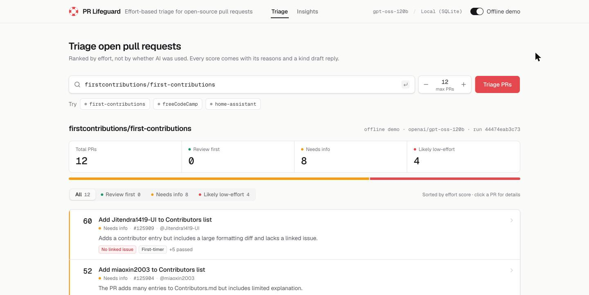
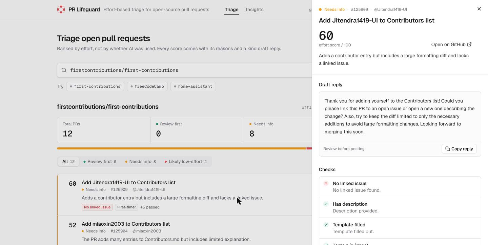
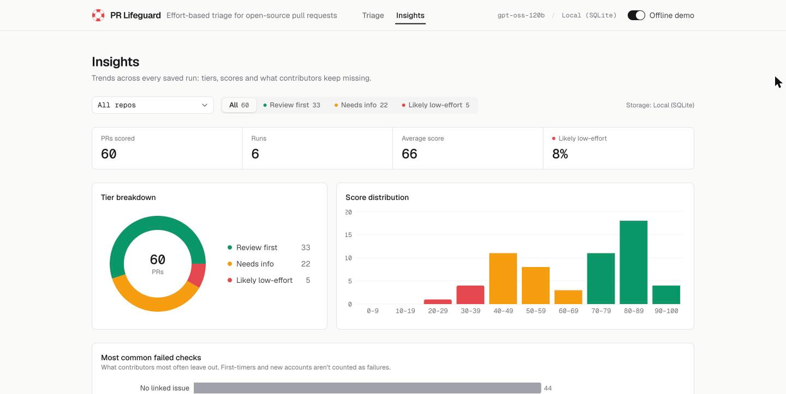

# PR Lifeguard

Open-source maintainers are drowning in low-effort pull requests. PR Lifeguard ranks a repo's open PRs by **effort**, not by whether AI was used, explains every score, and drafts a kind reply for each one.

**License: MIT** (see [LICENSE](LICENSE)) · Agent Skill: [`skills/pr-lifeguard/SKILL.md`](skills/pr-lifeguard/SKILL.md)



| PR details and draft reply | Insights across runs |
|---|---|
|  |  |

## Quick start

```bash
./dev.sh
```

Then open **http://localhost:3000** for the landing page, or go straight to the app at **http://localhost:3000/app**. The script creates `.venv` and installs `web/node_modules` on first run, starts the API on `:8000` and the web app on `:3000`, and stops both on Ctrl+C.

**Offline demo** (navbar switch, on by default) replays the runs saved in `demo_cache.json`. It needs no internet and no secrets. To triage any repo live, add secrets and switch it off.

### Secrets (live mode only)

Copy `.streamlit/secrets.toml.example` to `.streamlit/secrets.toml` and fill in:

| Section | Keys | Used for |
|---|---|---|
| `[llm]` | `base_url`, `api_key`, `model`, `fallback_model` | Any OpenAI-compatible endpoint. We use Groq with `openai/gpt-oss-120b`, falling back to `qwen/qwen3.8-27b`. |
| `[github]` | `token` | GitHub REST API (5,000 requests/hour instead of 60). |
| `[snowflake]` | `account`, `user`, `api_key` (PAT), `warehouse`, `database`, `schema`, `role` | Where every scored PR is stored (`PR_SCORES`), and what the Insights tab reads. If Snowflake is unreachable, the app falls back to local SQLite (`pr_lifeguard.db`). |

The secrets file is gitignored and is the only place keys live.

## How scoring works

1. **Fetch:** open PRs with their diffs, plus the repo's `CONTRIBUTING.md` and PR template (`github_client.py`).
2. **Seven rule checks** (`checks.py`): linked issue, description, template filled, tests touched, sensible size, account age, returning contributor. Account age and first-time contributor are shown as neutral context, never as a fault.
3. **LLM review** (`scorer.py`): an open-weight model reads the description, a diff excerpt and the contributing guide, then returns an effort score, a one-line reason, guideline issues, whether the description matches the code, and a polite draft reply. It is told to judge effort and fit, never whether AI was used, and never to claim anything it can't see in the diff.
4. **Final score** = 50% rules + 50% LLM. Tiers: **Review first** (70+), **Needs info** (40–69), **Likely low-effort** (under 40).
5. **Resilience:** on a rate limit the client switches models. If the LLM is unavailable, scoring falls back to the rule checks and says so in the reason. Storage falls back to SQLite.

## Open-source AI

Scoring uses [`openai/gpt-oss-120b`](https://huggingface.co/openai/gpt-oss-120b), an open-weight model released under the Apache 2.0 license, served through Groq's OpenAI-compatible API. The fallback, `qwen/qwen3.8-27b`, is open-weight too.

The model layer is swappable. `llm.py` talks to any OpenAI-compatible `/chat/completions` endpoint, so changing `[llm]` in `.streamlit/secrets.toml` is enough to switch providers, including a fully local model with [Ollama](https://ollama.com):

```toml
[llm]
base_url = "http://localhost:11434/v1"
api_key = "ollama"          # any non-empty value; Ollama ignores it
model = "gpt-oss:20b"
fallback_model = "gpt-oss:20b"
```

The project itself is open source under the MIT license, and the scoring logic is packaged as an [Agent Skill](skills/pr-lifeguard/SKILL.md) so other agents can run PR triage the same way.

## Architecture

```
web/            Next.js (App Router) + TypeScript + Tailwind + shadcn/ui (Base UI), Geist fonts, Recharts
  app/page.tsx      landing page (real sample results from demo_cache.json)
  app/app/page.tsx  the app: Triage + Insights tabs
  components/       navbar, triage/ (form, progress, list, drawer), insights/
  lib/api.ts        typed client; reads the triage Server-Sent Events stream
api/server.py   FastAPI wrapper around the Python pipeline (no scoring logic)
  GET  /api/health       model + storage backend
  GET  /api/demo-repos   repos available offline
  POST /api/triage       SSE: progress events, then one result (contract.py shape) or a friendly error
  GET  /api/history      saved results, newest first
pipeline.py     triage() / load_history(): the engine
github_client.py, checks.py, scorer.py, llm.py, storage.py, contract.py
app.py          the original Streamlit UI, kept as a backup
```

The web app talks to the API at `http://localhost:8000` (override with `NEXT_PUBLIC_API_URL`). Live runs run the pipeline in a background thread and stream progress. Each successful live run is also saved to `demo_cache.json`, so it becomes available offline.

UI components are the standard [shadcn/ui](https://ui.shadcn.com) set: Tabs, Switch, Tooltip, Sheet, Sonner, Skeleton, Table, Chart, Select, Empty, Kbd. The plan was to use [21st.dev](https://21st.dev) components, but its registry now requires an API key (`403 Authentication required`), so we used the stock shadcn versions.

## Run pieces separately

```bash
.venv/bin/uvicorn api.server:app --port 8000          # API
cd web && npm run dev                                   # web app on :3000
.venv/bin/streamlit run app.py                          # backup Streamlit UI
```

## Tests

```bash
.venv/bin/python test_checks.py --offline
.venv/bin/python test_scorer.py --offline
.venv/bin/python test_storage.py
.venv/bin/python test_github.py pallets/flask           # needs network
.venv/bin/python test_pipeline.py pallets/click 5       # live end-to-end contract check
cd web && npm run lint && npm run build
```

Built for Hacktoberfest Hack Day. A human always makes the final call; PR Lifeguard only drafts replies.
